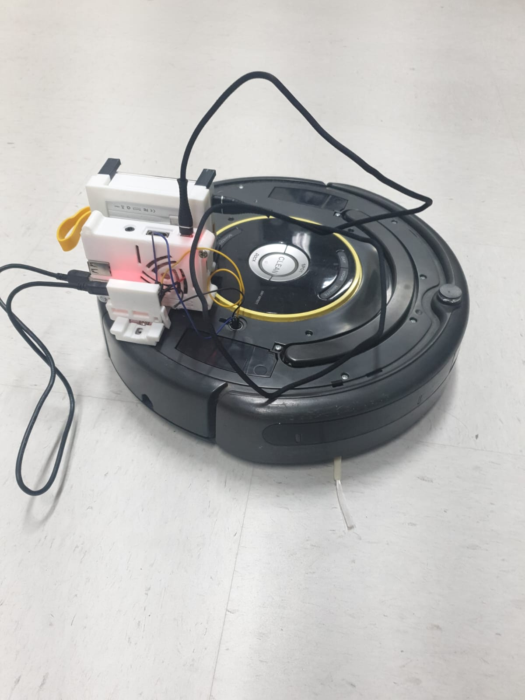

# Robô Roomba para Pista de Corrida


Figura 1: Roomba com Bateria, Raspberry e conversor USB para Serial.


# 1. Ligar o Raspberry

O raspberry já está com um cartão de memória com o Raspberry PI OS instalado. Então, precisa apenas fornecer energia para o Raspberry, que ele logo inicializará e permitirá ao usuario comunicar com ele através do SSH. Para ligá-lo, basta conectar o cabo USB-A em uma bateria de 5V com a porta USB-B micro no Raspberry, como mostrado na figura 1.


# 2. Comunicação com o Raspberry

O Raspberry branco está com o IP fixo ( 10.0.0.8 ) no roteador Intelbras e com um servidor SSH instalado e ativo. Então, pode-se acessar um terminal no raspberry usando o seguinte comando:

```bash
ssh vri@10.0.0.8
```

A senha é a padrão do laboratório.


# 3.1. Exemplo Simples

Exemplo mais simples possível para a inicialização do robô e movimentação dele.

1. Compilação:
```bash
cd ex01_simple
make
```

2. Execução:
```bash
./ex02_teleop
```

3. Comportamento Esperado

O Robô desliga o led do circulo do botão CLEAN, se movimenta para frente por 


4. Possíveis Erros


# 3.2. Exemplo Teleoperação

1. Compilação:
```bash
cd ex02_teleop
make
```

2. Execução
```bash
./ex02_teleop
```

# 3.3. Possíveis Erros

- Executando qualquer um dos exemplo e o robô não fazer nada. Possívelmente, precisa apertar uma vez o botão CLEAN do robô para ligá-lo. Ainda falta fazer o hardware para permitir ligar ele via software.